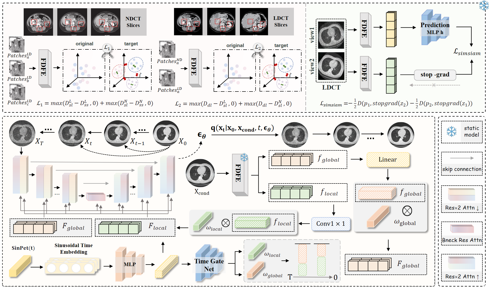
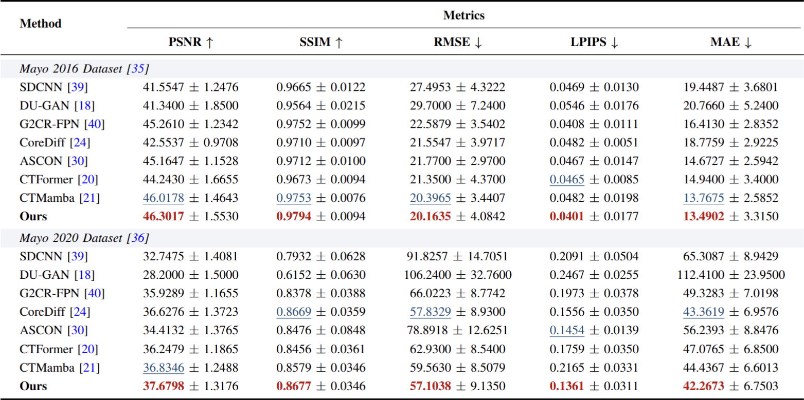
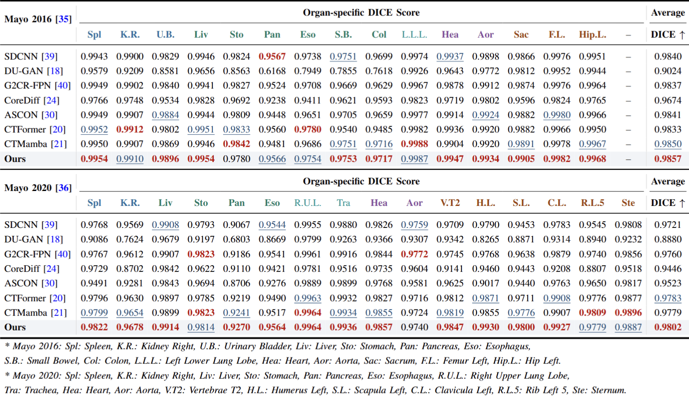
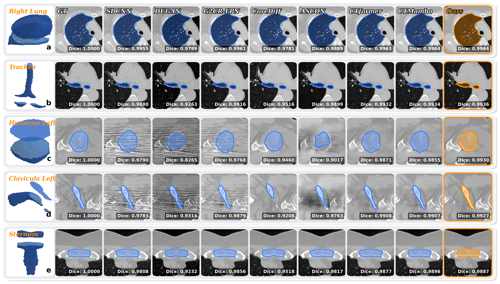

# AnatoReCT: Anatomy-Aware Conditional Diffusion for Low-Dose CT Reconstruction

## 💡 Primary contributions
To address severe quantum noise, structural degradation, and inefficient sampling in low-dose CT (LDCT) reconstruction, we propose AnatoReCT, a lightweight anatomy-aware conditional diffusion framework that explicitly exploits anatomical priors to restore diagnostically reliable normal-dose CT (NDCT) images.

1. Anatomy-Prior Guided Diffusion. We reformulate LDCT reconstruction as a conditional diffusion problem with a mean-preserving degradation process, preserving anatomical structures while reducing sampling complexity.

2. Dual-Branch Anatomy-Aware Feature Fusion. A frequency-decoupled encoder learns complementary low-frequency structural priors and high-frequency detail representations for tissue-adaptive reconstruction.

3. Temporal Gated Fusion. Global anatomical priors and local detail features are dynamically injected across denoising stages to improve structural consistency and fine-detail recovery.

4. State-of-the-Art Performance. AnatoReCT achieves 46.30/37.68 dB PSNR and 0.9794/0.8677 SSIM on the Mayo 2016 and Mayo 2020 datasets, outperforming existing methods in image quality and clinical evaluation.
   
## 🧗 Proposed method


The overall framework of **AnatoReCT**. Dual-branch anatomical prior learning and temporal gated conditional diffusion for efficient LDCT reconstruction.

## Table of Contents
- [Datasets](#-datasets)
- [Requirements](#-requirements)
- [Pre-trained](#-pre-trained)
- [Training](#-training)
- [Evaluation](#-evaluation)
- [Results](#-results)

## 📂 Datasets
We evaluate AnatoReCT on two public low-dose CT benchmarks:

- Mayo 2016 Low-Dose CT Challenge
- Mayo 2020 Low-Dose CT Dataset (Chest)

For the Mayo 2020 dataset, only the **Chest** subset is used in our experiments.

The paired LDCT/NDCT DICOM images are organized using file lists `*.flist` for training and testing. The default directory structure is:
```bash
anatorect/
├── train_gt.flist
├── train_input.flist
├── test_gt.flist
└── test_input.flist
```
Each `.flist` contains the absolute path to paired NDCT (ground truth) and LDCT (input) DICOM slices used during training and inference.

## 📝 Requirements
To install requirements:
```bash
pip install -r requirements.txt
```

## 🔖 Pre-trained

Before training **AnatoReCT**, please pre-train the following feature extractors:

- **HASC:** learns global anatomical priors.
- **SimSiam:** learns local anatomical priors.

Pretraining command：
```bash
# hasc
python simsiam_hasc/pretrain_hasc.py
```
```bash
# simsiam
python simsiam_hasc/pretrain_simsiam.py
```

Place the pretrained checkpoints under:
```bash
simsiam_hasc/checkpoints/
├── hasc_epoch_xxx.pt
└── simsiam_epoch_xxx.pt
```
> **Note:** During AnatoReCT training, both encoders are kept frozen and are only used to provide anatomical guidance for the diffusion model.

## 🔥 Training
To train our model in the paper, run this command:
```bash
python antorect/train.py
```

## 📃 Evaluation
To evaluate our model in the paper, run this command:
```bash
python antorect/test.py
```

## 🚀 Results
### Experimental Results
#### Quantitative Comparison

> **Note:** Quantitative comparison with state-of-the-art methods. Best and second-best results are highlighted in red and blue.


> **Note:** Quantitative comparison of downstream multi-organ segmentation performance. Best and second-best results are highlighted in red and blue.

### Visual Results
### Reconstruction Quality


> **Note:** Qualitative comparison with state-of-the-art methods. Residual error maps visualize reconstruction errors with respect to the ground truth.


> **Note:** Qualitative comparison of downstream multi-organ segmentation results. Segmentation masks are overlaid on reconstructed CT images for visual comparison.


> **Note:** Qualitative comparison of downstream multi-organ segmentation. Overlaid segmentation masks demonstrate structural consistency and contour preservation across different reconstruction methods.
